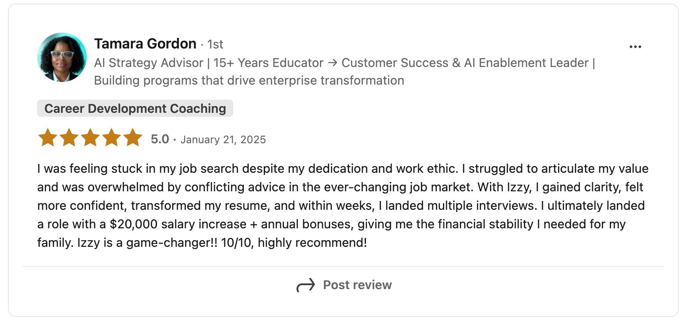
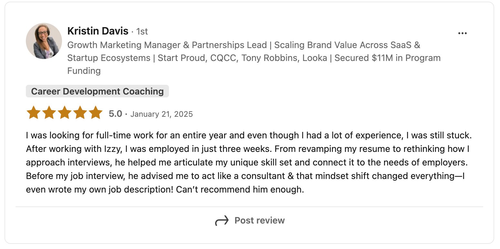
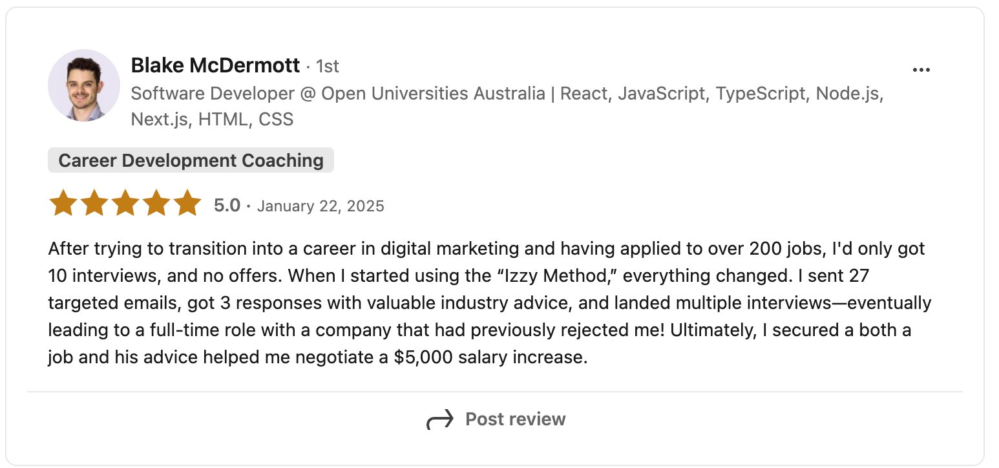
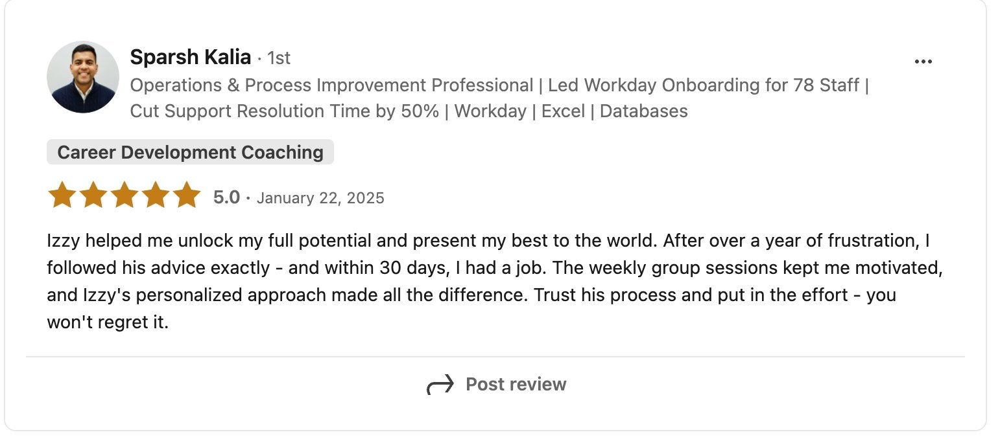
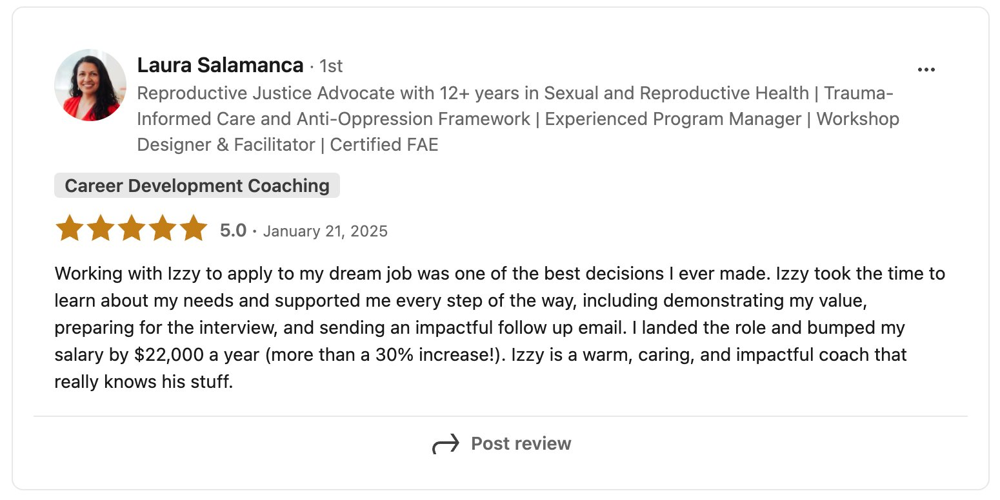
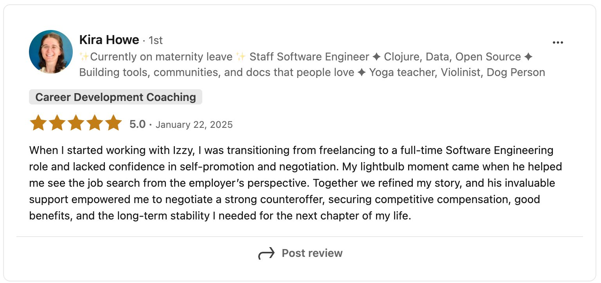

# The Job Search Ignition System

## an 8-week done-with-you job search accelerator program with Izzy

### Recharge. Rebuild. Relaunch.

For the senior professional who's been grinding alone - the Job Search Ignition System is a place to rebuild your assets, overhaul your strategy, and find your footing again. Together.

**🔥 10 Founding Spots Available**
**BEGINS MONDAY, MARCH 2, 2026 AT 10:30AM ET**

---

## You've tried going it alone. Let's try building it together.

You want accountability - not just advice you'll get to later.

You want to see your own achievements written out and think: *wait, I'm actually kind of incredible.*

You want a resume and LinkedIn that finally reflect the professional you actually are.

You want a strategy that makes sense - not just more effort layered on top of a broken system.

You want to feel recharged by this process, not depleted by it.

You've probably updated your resume more times than you can count. You've tailored cover letters, followed up with recruiters, sent LinkedIn connection requests into the void. You've been told your experience is impressive - and then heard nothing.

Maybe you've worked with a career coach before who gave you a framework and sent you on your way. Maybe you've taken a course you never finished. Maybe you've done everything "right" - and still can't explain why it's not working.

Still, you know this much:

👉 You've sent out 50-200+ applications that aren't converting into interviews or job offers

👉 You want someone to build this with you, not just tell you what to build

👉 You want a group of people who genuinely get it - who've been ghosted, doubted themselves, and kept going

👉 You want to walk out of this with real assets in hand, not a to-do list

👉 And you want to feel like yourself again - confident, clear, and ready

Welcome to the **Job Search Ignition System.**

A cohort of ten. Eight weeks of building, not just talking. Done-for-you resume, LinkedIn, and outreach assets. Three private sessions with Izzy. And a group of peers who will celebrate your first reply like it's the best news they've heard all week - because they know exactly what it took to get it.

**Sign up early and you'll get priority access to your first 1:1 session with Izzy - so your assets are in order and you're applying before the cohort even officially kicks off.**

---

## 🎥 What People Say

---

## 🛒 What's Included

The Job Search Ignition System holds 6 senior professionals at a time - small enough for real support, structured enough for real results.

Everything starts with your **AI Intake Interview** - a 45-60 minute async session where you answer questions and we extract the good stuff. From there, your deliverables get built and handed to you as they're ready, so you can start applying as quickly as possible.

Here's everything you walk away with -

---

### 🏗️ Your Foundation

- ☐ Professional Summary
- ☐ 15-20 Quantified Achievements *(CAR-formatted)*
- ☐ LinkedIn About Me *(full section, written)*
- ☐ LinkedIn Headline *(3 tested versions)*
- ☐ Custom LinkedIn Banner
- ☐ Headshot Review + Polish

---

### 🎯 Your Target Strategy

- ☐ 25-30 Target Companies *(curated and researched for you)*
- ☐ 5-8 Target Job Titles
- ☐ Salary Research Report
- ☐ Job Search Tracking Spreadsheet
- ☐ LinkedIn Boolean Search Strings
- ☐ Google Alerts Setup

---

### 📨 Your Outreach System

- ☐ AI-Automated Cover Letter Template *(custom per application in 30 seconds)*
- ☐ 3 Cold Email Templates *(recruiter / hiring manager / warm intro)*
- ☐ LinkedIn Connection Request Scripts
- ☐ Decision-maker search strings

---

### 🎤 Your Interview Toolkit

- ☐ STAR Story Bank *(10-12 stories, extracted and refined)*
- ☐ 15-20 Custom Interview Questions
- ☐ "Silver Bullet" Thank-You Email Template
- ☐ Salary Negotiation Framework + Script

---

### 🤝 3 × Private Sessions with Izzy

- **60-min Kickoff** *(Week 1)*
- **45-min Mid-Program Review** *(Week 4)*
- **60-min Closing Strategy Call** *(Week 8)*

Use them for strategy, asset reviews, accountability, confidence - whatever you need most.

---

### 📅 Weekly Monday Check-in Call *(30 min)*

Every Monday we set out your priorities for the week - so you always know exactly what to focus on and you're never starting the week adrift.

---

### 📅 Weekly Wednesday Group Call

A mid-week touchpoint to work through what's coming up, troubleshoot what's not working, and keep momentum going.

---

### 💬 WhatsApp Async Support *(Weekdays)*

Ask questions, get unstuck, share wins. Izzy's in your corner between sessions.

---

### 👥 Private Skool Community

The accountability engine of this program. Share job search frustrations, celebrate first replies, call each other forward. The community is where exhaustion turns into momentum.

> *"Having accountability is 1,000,000% beneficial. You felt like you weren't alone."*
> - Tamara Gordon, who landed multiple offers and negotiated a $20K raise

---

### 📝 LinkedIn Content System

A complete system to post on LinkedIn 1-2 times a week throughout your search - built directly from your stories, your achievements, and what you're learning and excited about. Showing up consistently on LinkedIn isn't just about visibility. It opens doors, warms up your network, and puts you front of mind with the exact people you want to reach.

---

### 🎙️ Weekly Voice Notes from Izzy

An async check-in every week - a question, a tip, a nudge - so you never feel like you're drifting.

---

### 🤖 Full AI Prompt Library *(30+ prompts)*

Resume, LinkedIn, company research, outreach, interview prep - ready to use in seconds.

---

## 👏 Founding Cohort Bonus

**Join the March cohort and your price is locked at $3,997 - $1,000 off standard pricing.**

Why the discount? You're willing to be first, give feedback as we build, and share a testimonial when you land. That's worth rewarding.

---

## 🧑🏼‍🤝‍🧑🏽 Who It's For

**This is for you if any of these ring true.**

- You're earning or targeting $100K+ in tech, product, data, engineering, finance, or marketing
- You've been laid off and you want to move strategically, not desperately
- You've sent out 50-200+ applications but they aren't converting into interviews or job offers - you're motivated, but your system is broken
- You've worked with coaches before who gave you advice and left you to figure it out alone
- You want a group of people who actually get it - who will celebrate your first reply, challenge your excuses, and keep you accountable
- You're quietly employed and searching, and you need something that works around your schedule - no evening calls, no one at work needs to know

If you've been grinding alone and getting nowhere, this is where you refuel.

---

## 🚫 Who It's Not For

This program is not the right fit if:

- You're early in your career or haven't yet held a professional role - the cohort is designed for senior professionals with 7+ years of experience
- You're not ready to put in 3-5 hours a week on your job search - the system works, but only if you work it
- You're looking for someone to just hand you a resume and send you on your way - this is a done-with-you program, not a done-for-you service
- You want a solo, self-paced experience - the group cohort is central to how this works, and the accountability is non-negotiable
- You're not targeting $100K+ roles - the assets, strategy, and targeting in this program are built for senior-level searches

If any of those feel like you right now, this probably isn't your moment - and that's okay. The right program at the wrong time isn't the right program.

---

## 🫰🏽 Your Investment

**Standard Price: $4,997**

| Option | Price | Best For |
|---|---|---|
| 💼 Pay in Full | $4,747 *(save $250)* | Professionals with severance or savings who want the discount |
| 💳 Pay in Instalments | Up to 12 monthly payments via Klarna | Maximum flexibility - available for Canadian clients only |

**About the Klarna payment plan:** Klarna requires a Visa debit card and payments come out as a direct withdrawal. This option is available to Canadian clients only.

[Choose your payment option and enroll here →]

---

## 📝 Frequently Asked Firestarters

*Thank you for reading these in full before joining.*

---

**"Is this really a group program, or just 1:1 coaching with Izzy?"**

It's both - and that's exactly what makes it different. You get three private sessions with Izzy. But the cohort is the secret weapon. When someone in your group gets their first reply after months of silence, the whole group feels it. When you're depleted and doubting yourself at Week 5, the group pulls you forward.

> *"Every Tuesday was my booster dose. I always came in boosted, and throughout the week with all the rejections, the pressure would build - and then Tuesday came and I had a group of people facing the same obstacles."*
> - Sparsh K., who applied to 600+ jobs with no success and landed in 1 month

---

**"What does 'recharging your batteries' actually mean in practice?"**

Most clients come in depleted. They've been applying for months, getting silence, and quietly starting to wonder if something is wrong with them. The first real turning point is working through the AI Intake Interview and watching your own achievements get reflected back to you - written out, quantified, made to sparkle.

> *"It just propels confidence 1,000%. It transcends everything - not just your resume, but how you show up in interviews, in networking, in how you see yourself."*
> - Kristin D., who went from 12 months unemployed to landing in 3 weeks

---

**"I'm currently employed. Can I still join?"**

Yes - the program is built for you. 90% of the work is done for you. The three private sessions fit around lunch breaks or flexible mornings. There are no evening calls. No one at your current job needs to know you're looking.

---

**"What if I land a job during the program?"**

That's the whole point. We pivot your remaining sessions to salary negotiation and onboarding strategy. You keep every asset and the full system, forever.

---

**"How is this different from hiring a career coach by the hour?"**

Most coaches charge $150-$300/hour to tell you what to do - then you go home and do it alone, usually not at all. Here, we build it together. You leave with 20+ real deliverables: resume bullets written, LinkedIn sections drafted, target companies researched, outreach templates ready. Not a to-do list. A complete system you own.

---

**"What's the time commitment?"**

Week 1: 60 min for the AI Intake + Kickoff. Weeks 2-7: 3-5 hours/week applying your system. Weeks 4 and 8: an additional 45-60 min for private sessions. If you can't commit 3-5 hours/week to your job search right now, this isn't the right moment - and that's okay.

---

**"Will the people in my cohort understand where I'm coming from?"**

The cohort is limited to 6 senior professionals targeting $100K+. Everyone in the room has 7-15 years of experience. Everyone has applied and been ghosted. Everyone has felt the creeping self-doubt of a search that won't end. You'll recognize each other immediately.

---

**"Do you guarantee I'll get a job?"**

No. I guarantee you'll leave with a complete, professional-grade system and 20+ custom assets. What I can say: clients using this system have landed roles in 3-8 weeks after spending 6-12 months getting nowhere. The system works when you work the system.

---

**"What if I'm still searching after Week 8?"**

Job searches take time - especially in this market. After the program, you can join the Alumni Community for $99/month: ongoing async support, monthly group Q&A, and access to new tools and templates as they're created. It's optional, and most people find it helpful while they're still actively searching.

---

## What Past Clients Have Achieved

**Tamara Gordon** - AI Strategy Advisor | 15+ Years Educator turned Customer Success Leader
*$20,000 salary increase + annual bonuses after months of rejection*
After months of rejection despite strong dedication, Tamara gained clarity, transformed her resume, and landed multiple interviews within weeks. She accepted a role with a $20,000 salary increase plus annual bonuses - giving her the financial stability she needed for her family.

---

**Kristin Davis** - Growth Marketing Manager & Partnerships Lead
*1 year unemployed. Hired in 3 weeks.*
Unemployed for an entire year despite having a lot of experience and still stuck. After working with Izzy, she was employed in just three weeks. He helped her articulate her unique skill set and shifted her mindset to act like a consultant in her interview - she ended up writing her own job description.

---

**Blake McDermott** - Software Developer
*200+ applications, zero offers - then 27 targeted emails and multiple interviews*
After applying to over 200 jobs and getting only 10 interviews and no offers, Blake tried the Izzy Method. He sent 27 targeted emails, got multiple responses, and landed a full-time role - at a company that had previously rejected him. He also negotiated a $5,000 salary increase on the offer.

---

**Sparsh Kalia** - Operations & Process Improvement Professional
*600+ applications over a year. Hired in 30 days.*
After over a year of frustration, Sparsh followed Izzy's advice exactly. Within 30 days, he had a job.

---

**Laura Salamanca** - Reproductive Justice Advocate & Program Manager
*Dream job landed. Salary up $22,000 - a 30%+ increase.*
Working with Izzy to apply to her dream job was one of the best decisions she ever made. He supported her every step of the way - demonstrating her value, preparing for the interview, and sending an impactful follow-up email. She landed the role and bumped her salary by $22,000 a year (more than a 30% increase).

---

**Kira Howe** - Staff Software Engineer
*Freelancer to full-time - with a negotiated counteroffer and the long-term stability she needed*
Transitioning from freelancing to full-time, Kira lacked confidence in self-promotion and negotiation. Her lightbulb moment came when Izzy helped her see the job search from the employer's perspective. Together they refined her story, and she negotiated a strong counteroffer - securing competitive compensation, good benefits, and the long-term stability she needed.

---

**Darin Mellor** - Project Manager (Tech)
*600+ applications, 3 interviews - then a full salary offer without taking a pay cut*
Before working with Izzy, Darin had applied to 600+ jobs and only landed three interviews. Izzy helped him slow down, focus on quality over quantity, and be proactive in reaching out to hiring managers. Things turned around rapidly - he signed an offer maintaining his full salary without having to take a pay cut like countless other job seekers.

---

**Raunika Lamge** - Customer Experience & AI Transformation Leader | ex-Accenture
*Director-level role landed after reframing her doubts and finding her unique value*
A key moment for Raunika was when Izzy helped her reframe her doubts by identifying her unique value. She stayed focused, landed a Director-level role at a large Canadian payments company.

---

## Important Dates

- **Cohort begins:** Monday, March 2, 2026 at 10:30am ET
- **Spots available:** 10 (first come, first served)
- **Sign up early** to unlock priority access to your first 1:1 with Izzy and get your assets built before the cohort officially kicks off

---

*If you're tired of grinding alone and ready to recharge, rebuild, and relaunch - this is your moment.*

**[Book your free 20-min Job Search Audit with Izzy →]** or **[Enroll in the April cohort now →]**

---

### How to Get Started

1. Book a free 20-minute Job Search Audit with Izzy
2. We'll diagnose what's broken in your current approach
3. Izzy will walk you through exactly what we'd build together
4. If it's a fit, choose your payment plan and we get started
